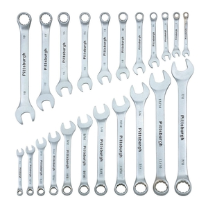

# What is libp2p?

> Good question! The one-liner pitch for libp2p is - 'libp2p is a modular system of protocols, specifications and libraries that enable the development of peer-to-peer network applications'.

In easy words, let's suppose you are at a hardware store and you want to buy some tools for your toolbox. Now, you see all the available wrenches in the store.

For most of us, we only want a few sizes of wrenches. So, we pick only the ones that we want.

Similarly, when we build a networking stack (toolbox) for our application, we only need a few protocols & modules (wrenches). So, we should be able to select what protocols and modules we want to use and use them independently.

Libp2p allows you to do the same for networking, as the hardware store does for the hardware tools, i.e. allowing you to select and use only the tools (protocols & modules) that you want to use.

Now, as everyone needs a different set of wrenches, similarly, every application needs a different set or **bundle** of protocols & modules.

The best way to understand & learn libp2p is to just understand what its each of its module does (which we would learn in more depth in the following chapters).

Though the above definition is enough, the resource that can answer this question in much more depth is ["What is libp2p?"](https://simpleaswater.com/what-is-libp2p/) by ["Simple As Water"](https://simpleaswater.com/)

# Some Tips before you start

The repository of libp2p is continuously changing, which means that there can arise some discrepancies such as :

- The updated version no more supports the API explained in the workshop, in which case you must create an issue [here](https://github.com/shresthagrawal/jslibp2p-chat-tutorial/issues).

- If you are referring to a wrong version of the documentation. Please check the exact version of the documentation that you are using. You can always find the your version of library in your `package.json` file.

- You might be using the right version and the right documentation, but still things aren't working. Well, there is a high possibility that the documentation from the official repo is not updated; in that case you must create an issue at [js-libp2p issues](https://github.com/libp2p/js-libp2p/)

- The master branch might contain changes in the documentation that is not yet released. It is recommended to check the latest documentation at [npm documentation](https://www.npmjs.com/package/libp2p) of js-libp2p.

> This tutorial uses js-libp2p v0.27.6. Please go to the official
> [website](https://docs.libp2p.io) to see the latest version.
