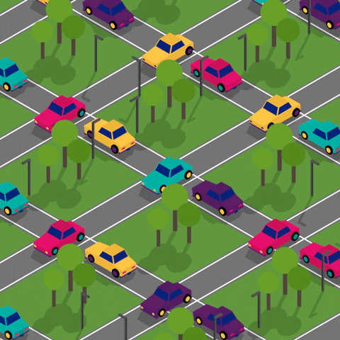

What is transport?
==================
TODO: Add a cool gif about transports
lets break it!

## What does transport means in p2p system?
As the word transport says itself, it does transportation; but of data between two peers. Currently our Internet uses & supports multiple standards of communication. These include the good-old and the most widely used TCP/IP protocol, web-sockets, MQTT, high-level protocols such as UDP etc. These standards are simply a set of rules that both communicating parties have to follow in order for a successful Internet communication. 

>TODO: Verify and add transports. For each transport link to the official documentation to show how they differ in the core implementation but still have the same functionalities. 

In a p2p system, it might not be clear about which of these standards does the other party supports. As these standards are drastically different from each other, it's difficult for a p2p system to implement each one from scratch. 

## This is where libp2p transports come
Although one thing that is very clear which is that even though every type of transport is different from each other on the basis of its core implementation and structure, they have certain operations in common eg. dialing other user, receiving packets, etc.

>TODO: Add better examples above. (Also, the sentence formation is incorrect)

`libp2p` uses this commonality to come up with an interface (a set of functions) that any module needs to follow in order to be used in an transport. Not only that but it also provides the implementation of the most important once. 	

>TODO: Link to the documentation of libp2p. 

>TODO: Link to the list of transport implementation.

Now any one can choose to easily plug any of the transport implementation without any pain. As well as you can also come up with your own transport (lets say `mars-wwq2`) you can follow the interface and that would work with any system that uses libp2p. 

## Use of transport in our awesome-p2p-chat-system
>TODO: explain that in the end you would have a way to communicate with other peers for out chat system

## Additional Reference
>TODO: SimpleAsWater/transports